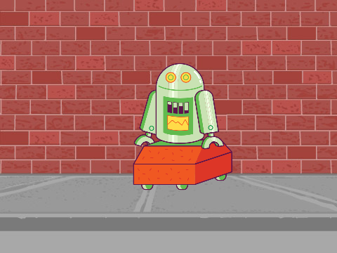

## Algorithms and Design Thinking

Computers are becoming more capable all of the time. For example:

- IBM Watson wins the game show Jeopardy [[video]](https://www.youtube.com/watch?v=P18EdAKuC1U)
- IBM Deep Blue defeats grand master at chess [[video]](https://www.youtube.com/watch?v=NJarxpYyoFI)
- AlphaGo beats two professional Go champions [[video]](https://www.youtube.com/watch?v=8tq1C8spV_g)
- Libratus beats professional poker players [[video]](https://www.youtube.com/watch?v=Jgau2BKTHbk)

These computers use complex algorithms – sets of instructions – to solve highly complex problems. Spend a few minutes [reading this article about algorithms](https://blog.pandorafms.org/what-is-an-algorithm/) before working through the following activities.

### Human Against Machine

We're going to explore the concept of algorithms further by looking at a game called _Pins_. 

- Your instructor will spend a few minutes showing a demo of the game.



Who would have thought that a computer could out-bluff a human? Let's fight back!

Follow these steps:
- [Download and read the rules of Pins](docs/Pins.pdf)
- Find a partner to work with - two minds are better than one!
- Using the sticks your instructor has provided, play a few games against each other. One of you will be the human and the other will be the computer. You should alternate between who goes first in each game. Your goal is to determine if there is an algorithm you can use to win the game every time.
- Use the provided pens and paper to help find a solution and/or draw a visual model of your solution.

Spend around 25 minutes working on your solution before we move on.

### Generalising the Algorithm

Hopefully you managed to find a strategy to win every time with 21 pins, but what if we start the game using a different number of pins? Does your algorithm still guarantee you the win? 

The [Python](https://www.python.org/) script below will allow you to test your solution using any number of pins. Copy and paste the code into the editor section of this [Online Python Interpreter](https://repl.it/languages/python3) and click _Run_. 

You'll see some statements printed out to the console on the right side of the page. Use your keyboard to play the game by entering the values it asks for. You can start the game again at any time by clicking _Run_ again.

```
from random import randint

class PinsHumanAgainstMachine:
    playAgain = True
    numberPins = 21
    takePins = 0
    computer = 2
    human = 1
    whoseTurn = 1
        
    '''
    Sets whether the player is going first or second
    '''
    def setPlayerOrder(self,humanNumber):
        self.human = humanNumber
        if self.human == 1:
            self.computer = 2
        else:
            self.computer = 1
        self.whoseTurn = 1
        
    '''
    Completes all the actions required for a turns
    '''
    def processTurn(self,takePins):
        if takePins < 1 or takePins > 3:
            print("Invalid number of pins!")
        elif takePins > int(self.numberPins):
            print("Too many pins selected!  Pins remaining: " + self.numberPins + ".")
        else:
            self.numberPins = int(self.numberPins) - takePins
      
        if self.whoseTurn == 1:
            self.whoseTurn = 2
        else:
            self.whoseTurn = 1
      
        if self.numberPins == 0:
            winner = ""
            if self.whoseTurn == self.human:
                winner = "Human"
            else:
                winner = "Machine"
            print("Game Over! " + winner + " wins!")
        else:
            print("Pins remaining: " + str(self.numberPins))

def playGame(gameObject):
    print("WELCOME TO PINS - GAME RULES\n");
    print("A machine and a human take it in turns to remove 1, 2 or 3 pins from a single pile.");
    print("Whoever takes the last pin loses the game.\n");
    
    gameObject.numberPins = input("How many pins do you want to have in the initial pile?\n")

    while int(gameObject.numberPins) <= 1:
        print("You need at least 2 pins, please try again!")
        gameObject.numberPins = input("How many pins do you want to have in the initial pile?\n")
        
    playerFirst = input("Do you wish to go first? Y/N\n")
    while playerFirst != "Y" and playerFirst != "y" and playerFirst != "N" and playerFirst != "n":
        print("Invalid input, please try again using only Y or N!")
        playerFirst = input("Do you wish to go first? Y/N\n")
    
    if playerFirst == "Y" or playerFirst == "y":
        gameObject.setPlayerOrder(1)
    else:
        gameObject.setPlayerOrder(2)
        
        
    while int(gameObject.numberPins) > 0:
        gameObject.takePins = 0;
        if gameObject.whoseTurn == gameObject.human:
            gameObject.takePins = input("Human: how many pins do you wish to take?\n")
    
            while gameObject.takePins.isdigit() == False:
                print("Not a valid input, please enter 1, 2 or 3!")
                gameObject.takePins = input("Human: how many pins do you wish to take?\n")
            gameObject.processTurn(int(gameObject.takePins))
        
        else:
            gameObject.takePins = (int(gameObject.numberPins) - 1) % 4;
        
            if gameObject.takePins == 0:
                print("I have no optimal move to make!")
         
                gameObject.takePins = randint(1, 3)
            
            print("Machine takes pins: " + str(gameObject.takePins))
        
            gameObject.processTurn(gameObject.takePins)

    
playGame(PinsHumanAgainstMachine())
```

After playing the game with different values, spend a few minutes reading the Python code and trying to determine what each part is doing. Can you find the line(s) of code that the computer is using to beat us? Feel free to change some values and run the program again to see how it changes the outcome. 

If something goes wrong, you can always copy and paste the original code in again.

### Exploring the code in Scratch


### Markdown

Markdown is a lightweight and easy-to-use syntax for styling your writing. It includes conventions for

```markdown
Syntax highlighted code block

# Header 1
## Header 2
### Header 3

- Bulleted
- List

1. Numbered
2. List

**Bold** and _Italic_ and `Code` text

[Link](url) and 
```

For more details see [GitHub Flavored Markdown](https://guides.github.com/features/mastering-markdown/).
